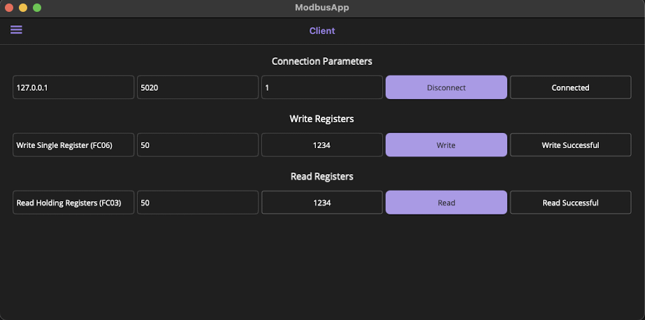

# Modbus Application (MAUI)

This is a cross-platform Modbus Client application built with .NET MAUI, enabling communication with Modbus devices through TCP. It allows users to interact with devices by connecting, writing, and reading Modbus registers.

## Features

- **Connection Management**: Users can connect or disconnect from a Modbus server by providing the server IP address, port, and device ID.
- **Write Registers**: Users can write to Modbus registers (coils and holding registers) by selecting a function and providing the address and value.
- **Read Registers**: Users can read from Modbus registers, with options for various read functions (coils, discrete inputs, holding registers, and input registers).
- **Feedback**: Provides real-time feedback on the connection status, write operations, and read results.

## Technology Stack

- **.NET MAUI**: Cross-platform framework for building native applications for iOS, Android, macOS, and Windows.
- **Modbus**: Protocol for communication with industrial devices.
- **CommunityToolkit.Mvvm**: Used for MVVM pattern and reactive properties.

## How to Run

1. Clone the repository.
2. Open the solution in JetBrains Rider or Visual Studio.
3. Build and run the project on your desired platform (macOS).
4. Enter the connection parameters (IP, port, device ID) and interact with Modbus registers.

## Screenshots
